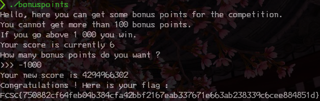

# Bonus points

catégorie | points
:---: | :---:
intro | 20

## 0x0 Intro

>Qui n'a pas envie de quelques points bonus ? Obtenez un score supérieur à 1000 pour débloquer le flag.
>
>nc challenges2.france-cybersecurity-challenge.fr 4001

## 0x1 Reconnaissance

Comme d'habitude, la première chose est de regarder le challenge en lui même,
on l'execute, et nous arrivons sur un petit jeu qui nous attribu des points de
façon aléatoire et toujours en dessous de ce que nous avons besoin.

Nous jouons le jeu juste pour voir ce qui ce passe:

Nous essayons de lui faire prendre plus que ce que nous avons:

## 0x2 Exploitation

Ce challenge pourra se jouer sur la gestion des entiers signés/non-signés, 
**int** et **uint**.

En effet, selon la construction, un entier négatif pourra se transformer en un
positif plus élevé.

Essayons de lui donner -1000 par exemple:

## 0x3 TL;DR

Ce challenge était sur la mauvaise initialisation d'une variable. Lors de la 
transformation dans l'application, une valeur négative peut se transformer en 
un entier positif.
