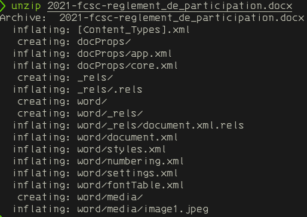
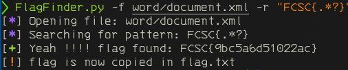

# Dérèglement

catégorie | points
:---: | :---:
intro | 20

## 0x0 Explication

On nous annonce que le règlement du tournois a été modifié par des petits malandrin.
Charge à nous de retrouver la modification effectuée.

SHA256(2021-fcsc-reglement_de_participation.docx) = 7538e4b5a4b392e6810e1bd6360dcf000424cf66c6b1dcc8f296751785c1b020

## 0x1 Reconnaissance

Un avantage avec le format docx, c'est que c'est un gros zip, nous allons pouvoir
utiliser foremost pour extraire et rechercher le flag.

Le format docx est structuré avec des dossiers et des fichier au format xml,
l'important est que le texte du document est situé dans le fichier document.xml
et le style dans styles.xml.

## 0x2 Exploitation

On commence par décompresser le fichier, soit avec unzip, soit avec formost.

Une fois le fichier décompressé, il faudra aller se rendre dans le dossier 
[appname]\document.xml, pour nous cela sera donc word\document.xml.

Ça sera une très bonne occasion d'utiliser mon petit code en python [flagfinder](https://github.com/tiphergane/FlagFinder)

Le flag final est donc:

>FCSC{9bc5a6d51022ac}

## 0x3 TL;DR

Un fichier docx est une archive zip avec des informations stockées dans des fichiers
au format **.xml**.

Il suffit donc de savoir dans quel fichier chercher pour trouver la solution.

Dans notre cas, le document.xml, et à l'aide de flagfinder, nous avons automatisé la recherche.
