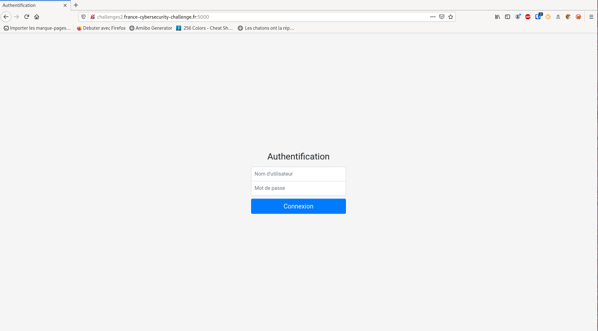
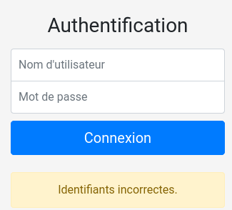
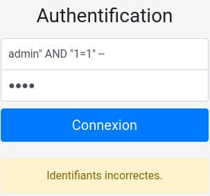
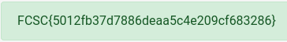

# Push It to the Limit 

catégorie | points
:---: | :---:
intro |  20

## 0x0 Intro

>Exploitez une injection SQL afin de vous connecter sur l'application web.

>http:\//challenges2.france-cybersecurity-challenge.fr:5000/

## 0x1 Explications

Un autre classique, l'injection SQL. L'explication est très clair, nous allons
devoir injecter une requete SQL dans le form afin de bypasser la vérification
et devenir admin.

## 0x2 Reconnaissance

On se rend à la page indiquée, et nous arrivons sur une vérification habituelle
user/mdp. l'injection se fera donc dans l'une des deux boxes.



Premier test à la con, c'est de tester avec un couple bidon afin de regarder
comment le site réagi. Dans mon cas, admin/admin



très bien, nous restons sur la même page, un popup nous explique que les id 
sont faux.

## 0x3 Exploitation

C'est parti pour rentrer dans le vif du sujet, lors de la tentative d'auth 
le site envoie une commande qui ressemble à celle ci à sa base de données:

```SQL
SELECT id, username FROM users WHERE username = '".$username."' AND password = '".$password."'"
```

Et si la réponse est positive, alors elle laisse passer.

Comment pouvons nous donc bypasser cela ? tout simplement en lui envoyant une
requête de notre choix, qui répondra toujours oui.

Cette requette au final ressemblera un peu à celle ci:

```SQL
SELECT id, username FROM users WHERE username = '".$username."' AND "1=1" -- AND password = '".$password."'"
```

Avez vous vu la différence ? après nos **- -** le reste de la requête originale 
est mise en commentaire. Elle ne sera donc plus interprétée par le site, et le
**AND "1=1"** quand à lui va créer une réponse toujours positive, et donc nous
 laisser accéder au site

L'injection dans la boite username ressemble à cela:

>admin" AND "1=1" --

et pour le met de passe, vous êtes libre de mettre n'importe quoi.



Et elle nous apporte au flag:



## 0x4 TL;DR

Dans cet exercice, le but était de bypasser le mécanisme d'authentification
mis en place sur un site web avec un couple MySQL/PHP.

L'utilisation d'une injection SQL est possible car le site ne vérifie pas les
entrées, et elles sont donc interprêtées et éxécutées.

Une collection d'injection est disponible sur le super Github de 
[PayloadAllTheThings](https://github.com/swisskyrepo/PayloadsAllTheThings/tree/master/SQL%20Injection)
