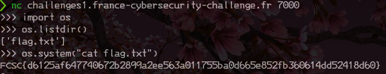

# Snake

catégorie | points
:---: | :---:
intro | 20

## 0x0 Intro

>L'apprentissage du langage Python est très utile en CTF. On vous demande ici de lire le fichier flag.txt.
>
>nc challenges1.france-cybersecurity-challenge.fr 7000

## 0x1 Reconaissance

Une fois connecté sur le canal, nous arrivons dans une console python, ceci ne
nous étonnes pas étant donné la description du challenge.

Nous allons donc devoir, via python, explorer le système à la recherche du flag.

Pour cela, nous allons avoir besoin de la bibliothèque **os**

## 0x2 Exploitation

C'est très simple et cela tiens en 3 lignes de code. Mais avant  nous allons 
détailler un peu ce que nous voulons.

Nous allons devoir charger la librairie **os**, qui ne l'est pas de base, pour cela
nous allons utiliser la fonction **import**.

```python
import os
```

Une fois importée, nous allons pouvoir lister les fichiers présent:

```python
os.listdir()
```

Une fois la cible acquise, nous allons utiliser les outils du serveur pour 
l'extraire:

```python
os.sytem("cat flag.txt")
```



## 0x3 TL;DR

Cet exercice était un exercice de culture général sur Python.

Nous avons donc du **importer** une **librairie** (os en l'occurence), puis
utiliser ses fonctions afin d'extraire le flag.
