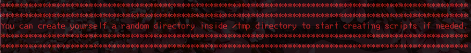
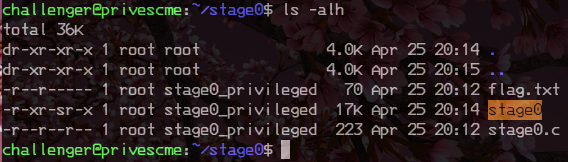
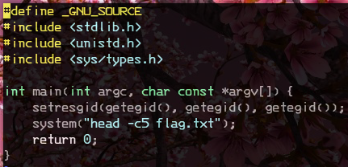
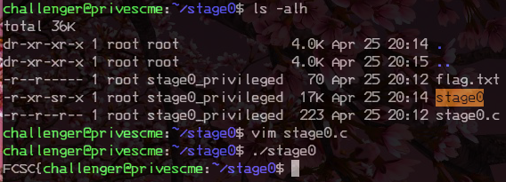
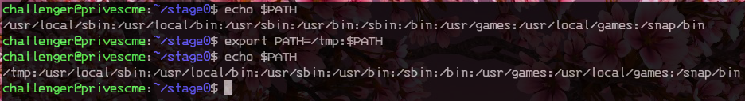

# Privesc Me (1) - Warmup

catégorie | points
:---: | :---:
misc | 25

## 0x0 Intro

>Un challenge d'échauffement vous attend dans le dossier stage0. À vous de trouver un moyen d'augmenter vos privilèges.
>
>ssh -p7005 challenger@challenges1.france-cybersecurity-challenge.fr (mot de passe : challenger.)
>
>Note : cet environnement est partagé entre les 4 challenges Privesc Me. Le dossier /tmp est nettoyé fréquemment.

## 0x1 Reconnaissance

Dès la connexion, le serveur nous donne une information super importante:

C'est très important, car nous savons que nous allons pouvoir manipuler les paths
si besoin, et croyez moi, on ne va pas se gêner !

Nous allons commencer comme d'habitude par lister les fichiers disponible: 

Oh joie, nous avons le stage0.c, nous allons donc pouvoir l'étudier:

C'est un simple appel system à **head** avec en paramètre **-c 5** pour ne lire
que les 5 premiers caractères.

Si nous executons le stage compilé, nous avons ce retour:

## 0x2 Exploitation

Maintenant que nous en savons un peu plus sur le défi, nous allons pouvoir mettre 
en place notre attaque.

Pour cela, nous allons abuser la variable d'environnement **$PATH**.

Path fonctionne de façon litérale, et va chercher dans l'ordre proposé si le binaire
est dans le répertoire.

Comme nous savons que nous pouvons écrire dans **/tmp** nous allons le mettre
en premier dans le path.

Cela ce fait de la façon suivante:

Une fois que nous avons réussi à modifier le PATH, nous allons déplacer VIM dans
/tmp, et le renommer en head.

Pourquoi VIM ? car il ne va pas tenir compte du paramètre -c.

Une fois cela fait, il ne nous reste plus qu'à exécuter stage0, et profiter de 
notre flag:

## 0x3 TL;DR

Sur cet exercice, nous avons mis en place une modification du **$PATH** afin de 
changer le binaire **head** par **vim** afin de lire le flag.

Nous avons profité que le **/tmp** soit libre à l'écriture afin de mettre en 
place notre substitution.

Une fois cela fait, l'exécution de stage0 nous affichera le flag complet.
