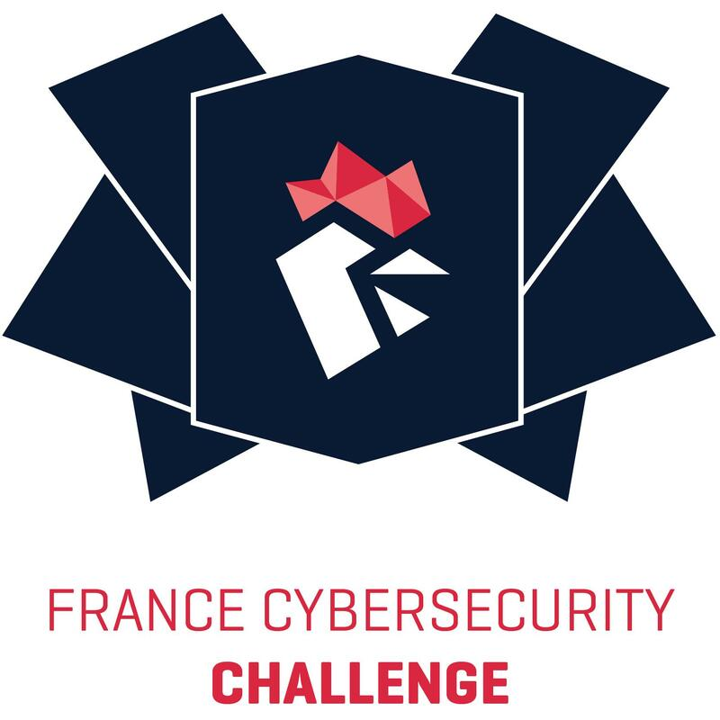
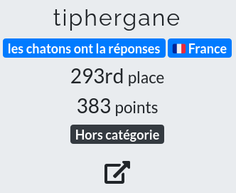
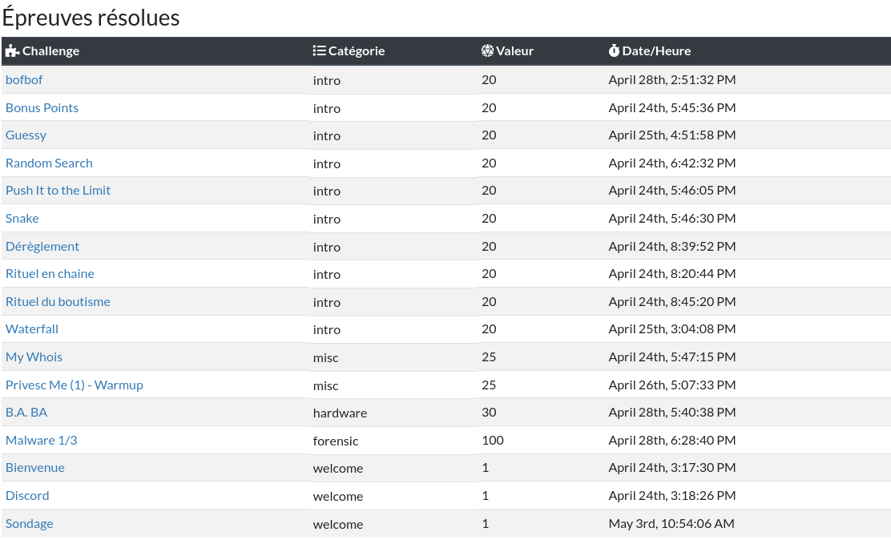
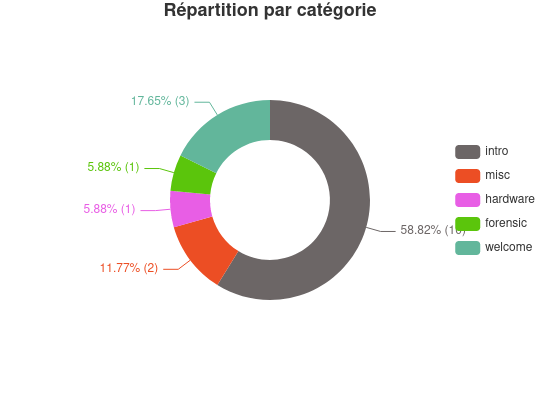

# [FCSC 2021](https://www.france-cybersecurity-challenge.fr/)

Cette année encore l'ANSSI nous a offert l'opportunité de nous mesurer sur des challenges divers et variés

La compétition s'est déroulée du 23 avril au 03 mai 2021.

J'ai participé à cette compétition pour la 2nd année consécutive en hors catégorie.

Vous retrouverez ici tout les chall que j'ai réussi à terminer.

L'année dernière, j'avais:

* Fais 253 points
* Terminé 13 défis

Cette année, j'ai terminé avec:

* 383 points
* 14 défis

Mon objectif fixé à donc été dépassé ! Avec un magnifique chall flaggé à 145 points,
mais qui a été revu à 100 points avec la règle de notation dynamique.

Avec une répartition comme ci-dessous:

